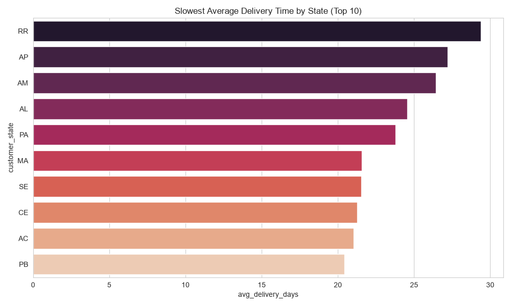
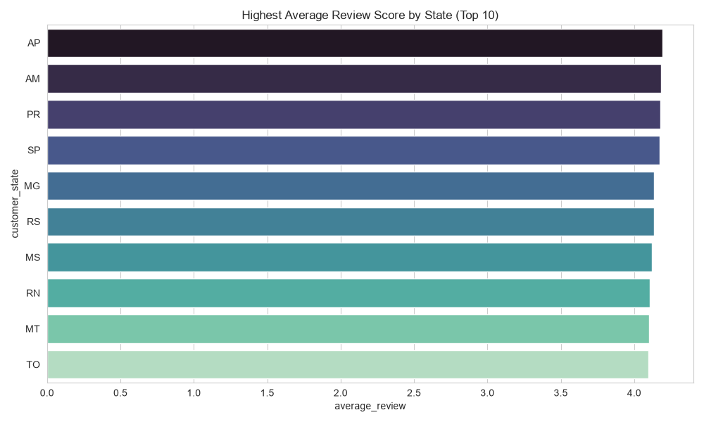
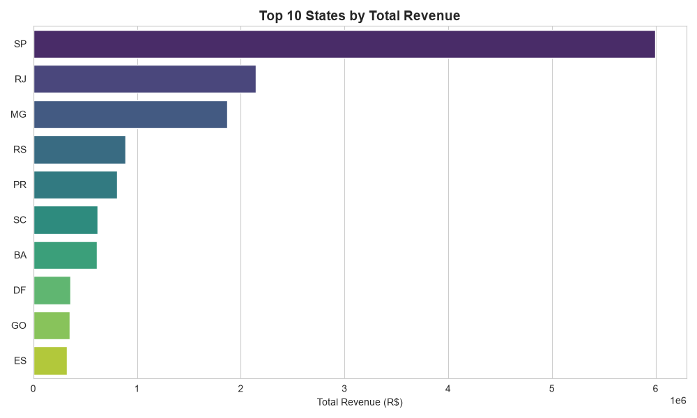
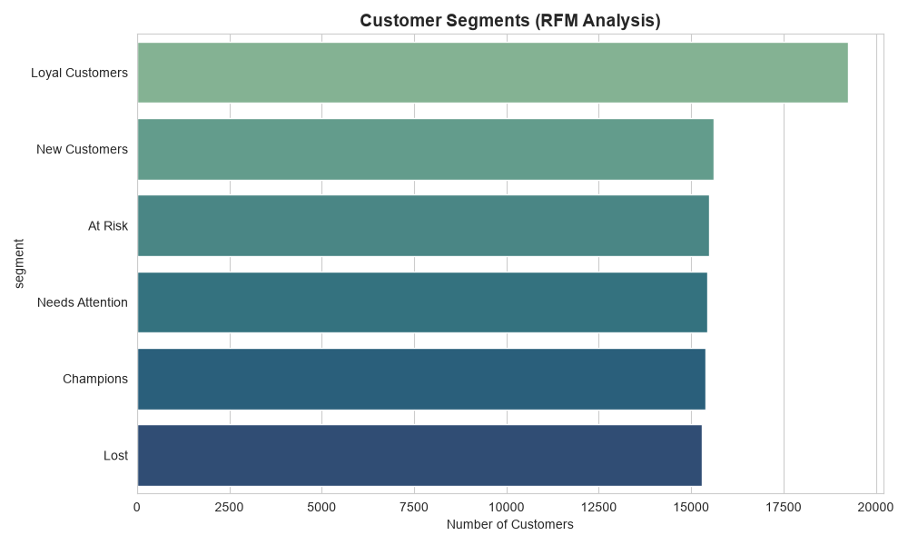

# E-Commerce Business Performance & Customer Retention Analysis

Analysis of the Olist Brazilian E-Commerce dataset (2016–2018), covering 96,000+ customers across 9 relational tables, exploring delivery performance, customer satisfaction, revenue distribution, and customer segmentation.

## Dataset
Source: [Brazilian E-Commerce Public Dataset by Olist](https://www.kaggle.com/datasets/olistbr/brazilian-ecommerce) (Kaggle)
9 relational tables: orders, customers, order_items, payments, reviews, products, sellers, geolocation, category translation.

## Key Steps
- Loaded 9 CSVs into a SQLite database and wrote SQL joins across orders, customers, payments, and reviews tables
- Handled nulls correctly (excluded undelivered orders from delivery-time calculations)
- Calculated delivery duration using date arithmetic (`julianday`) rather than raw date columns
- Built RFM (Recency, Frequency, Monetary) customer segmentation using quintile scoring, with tie-handling for customers who ordered only once
- Tested a hypothesis (delivery speed drives review scores) using correlation analysis rather than assumption

## Key Insights
1. **Delivery time varies dramatically by region** — remote Northern states (RR, AP, AM) see average delivery times of 26–29 days, over 3x longer than São Paulo (8.8 days), reflecting Brazil's logistics infrastructure gap.
2. **Delivery speed only weakly predicts review score** (r = -0.152) — despite the large delivery-time gap, review scores don't drop proportionally in slow-delivery states (AP and AM actually rank among the highest-reviewed states). This suggests product quality and listing accuracy likely matter more than shipping speed for customer satisfaction.
3. **São Paulo dominates both order volume and revenue**, consistent with Olist's home-market concentration — a useful baseline for market expansion analysis.
4. **Customer base is fairly evenly split across RFM segments** (15,000–19,000 customers per segment out of ~96,000), with "Loyal Customers" the largest segment (19,245) and "Lost" the smallest (15,304) — indicating a relatively balanced but not concentrated customer base, with room to convert "At Risk" (15,492) customers back to active before they churn fully.

## Charts





## Tools Used
Python, Pandas, SQLite (SQL joins, aggregation, window-style logic), Seaborn, Matplotlib, Jupyter Notebook

## How to Run
```bash
pip install -r requirements.txt
jupyter notebook ecommerce_analysis.ipynb
```
